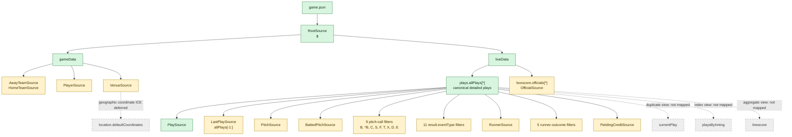

# Logical Source Shape

The mapping defines 37 logical sources over one untouched JSON document. The source count is larger than the number of canonical record structures because pitch calls, runner outcomes, and result types are selected with separate JSONPath filters.

## Shape observation

The mapping correctly anchors detailed events on `allPlays`, but the filtered logical sources repeat traversal of the same nested arrays. This is simple and declarative, though processor performance should be measured at season scale.
