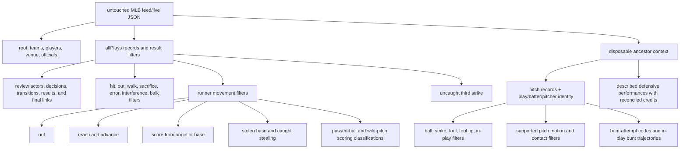

# Logical-source partitions

The [generated catalog](patterns/README.md) owns the current inventory.
Repeated filters are deliberate:
one source record may support distinct acts, physical processes, judgments,
decisions, calls, counted processes, records, sites, roles, and artifacts. The
temporary context adds ancestor identity but never changes or replaces the raw
source. Source partitions never collapse those individuals.
