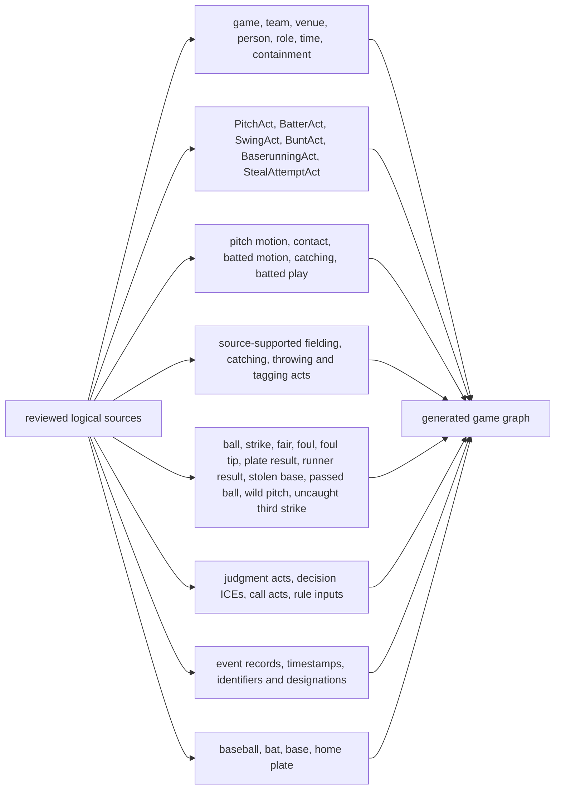

# Triples-map families

The Triples Maps are separated because each identity-bearing ontological
category receives its own individual. Multiple maps may add types or relations
to the same stable individual, such as a plate result receiving its most
specific outcome type or one foul-tip process receiving both FoulTipProcess and
StrikeProcess types.

Use the [generated catalog](patterns/README.md) for the exact current maps and
relations. These overview categories do not imply that all source fields or
all physical acts are evidenced by every play.
