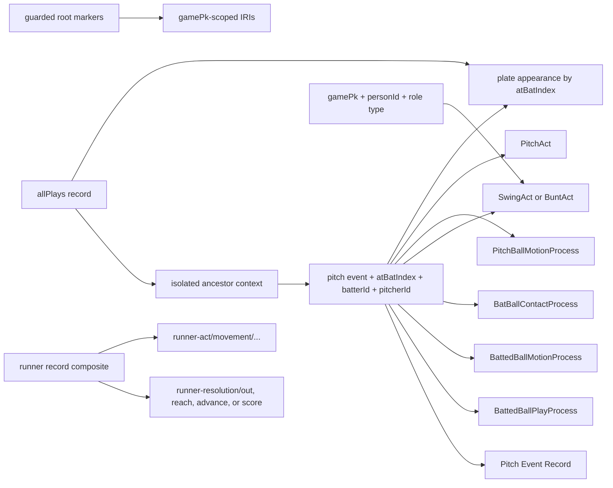

# Joins and identity strategy

The execution harness materializes safe numeric root markers for game, venue,
teams, official scorer, and home-plate umpire into an isolated mapping copy.
It also produces a disposable context copy that carries enclosing play identity
onto nested pitches, avoiding the processor's incomplete parent-array join.
If an optional adjudicator is absent, marker-bearing participant and role
assertions are removed from the temporary mapping. The raw JSON and checked-in
RML remain unchanged.

Runner objects still lack ancestor atBatIndex and an array index. Their documented source-field composite remains game-scoped and collision-validated, but runner acts cannot yet be linked safely to one plate appearance.
