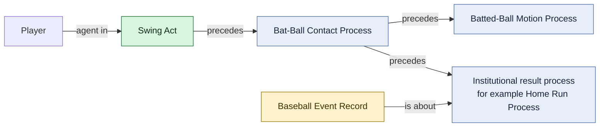
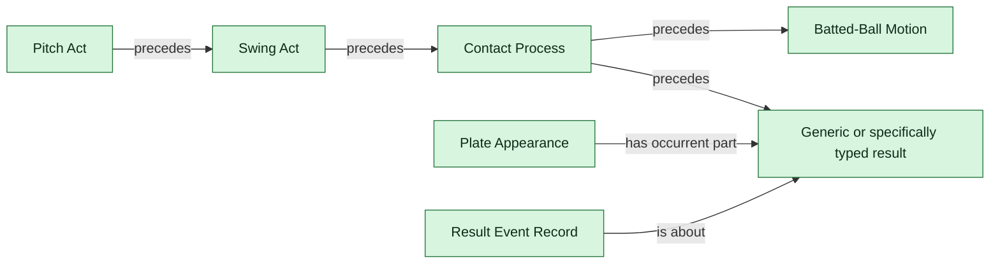

# Event Process Chain

## Intended ontology-first chain

## Explicit shape in the current RML

The mapping makes the batter agent of the Swing Act rather than agent of the result. Contact processes are now explicitly connected to the enclosing plate-appearance result through the same source-backed `playId` join used elsewhere, using temporal precedence rather than causation.
