# Implemented shape and retained gaps

```mermaid
flowchart TB
    CURRENT["processor-proven revised RML"] --> DONE["implemented"]
    CURRENT --> GAP["retained boundary"]
    DONE --> D1["distinct act, physical, judgment, decision, call, result, record, time, site, role, and artifact IRIs"]
    DONE --> D2["pitch and batted-ball physical chains"]
    DONE --> D3["constitutive adjudication for counted outcomes"]
    DONE --> D4["game-scoped roles and neutral runner-act paths"]
    DONE --> D5["foul-tip and strike share one counted individual"]
    DONE --> D6["sac_bunt maps BuntAct instead of SwingAct"]
    DONE --> D7["disposable ancestor context replaces incomplete nested joins"]
    DONE --> D8["replay records preserve distinct decisions, review results, and final outcomes"]
    DONE --> D9["null runner placeholders remain records while passed-ball, wild-pitch, and uncaught-third-strike patterns stay distinct"]
    GAP --> G2["fielding credits lack ancestor-aware act identity"]
    GAP --> G3["ambiguous two-strike foul count"]
    GAP --> G4["coordinate values lack approved datatype properties"]
    GAP --> G5["non-pitch advisory action identity and class coverage"]
    GAP --> G6["non-pitch reviews do not identify the individual base umpire"]
```

The direct mapping is processor-proven for the tracked completed-game sample.
Static validation reports 345 Triples Maps, 98 logical sources, no
referencing-object joins, and no undeclared BaseballO classes. Generated-RDF
validation enforces complete ancestor context on all 282 pitches, all 134
swing/bunt acts, and all 112 contacts; a single terminal game timestamp;
pitch-motion and contact chains; institutional judgment; shared
foul-tip/strike identity; fair-result sequencing; and source-record separation.
