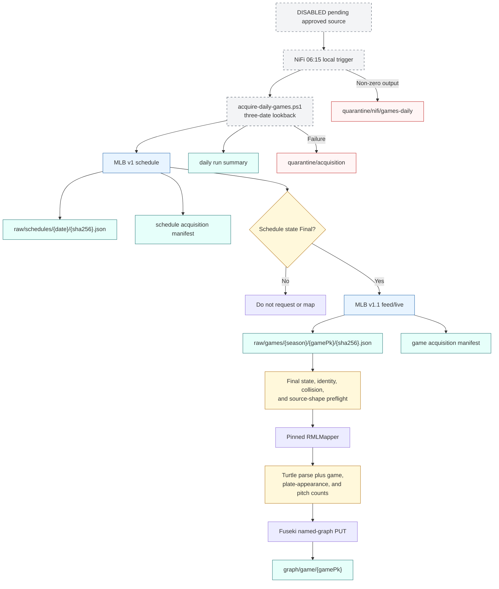

# Parked daily game acquisition

This diagram preserves the earlier external-acquisition design for later review. Its NiFi processors are stopped, and it is not the active operational path pending an approved data-access source.

The source JSON never receives helper fields. Root identifiers required by nested RML subjects are inserted only into an isolated mapping copy, and every run records the source and effective mapping hashes.
