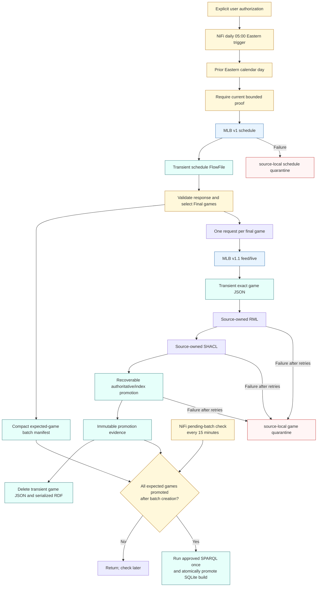

# Daily scheduled external game acquisition

The user-authorized acquisition runs every day at 05:00 Eastern inside the
source-owned `MLB Game` NiFi group. It does not require an attached monitor.

The source JSON never receives helper fields. Root identifiers required by
nested RML subjects are inserted only into an isolated mapping copy, and every
run records the source and effective mapping hashes. The schedule response is
not persisted as raw JSON; only its hash, date range, and expected final-game
identifiers remain in the compact batch manifest. A game response is discarded
only after successful graph-pair promotion and cleanup evidence.
