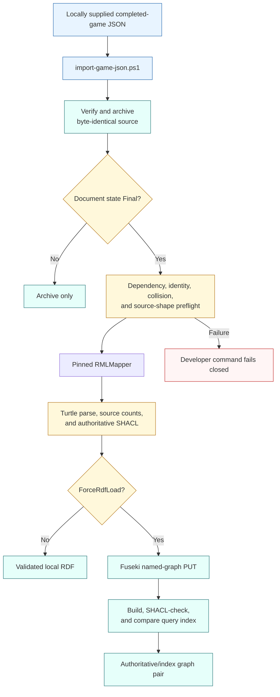

# Direct game import fallback

This is a focused developer fallback and parity path, not an active NiFi
inbox. It reads a local completed-game response and makes no external HTTP
request. Routine acquisition uses the source-owned `MLB Game` NiFi group.

The source file is parsed for validation but never rewritten. The archive copy
and caller's original are checked against the pre-import SHA-256 hash. This
command does not substitute for NiFi scheduling, proof release, retry,
quarantine, provenance, or corpus materialization.
