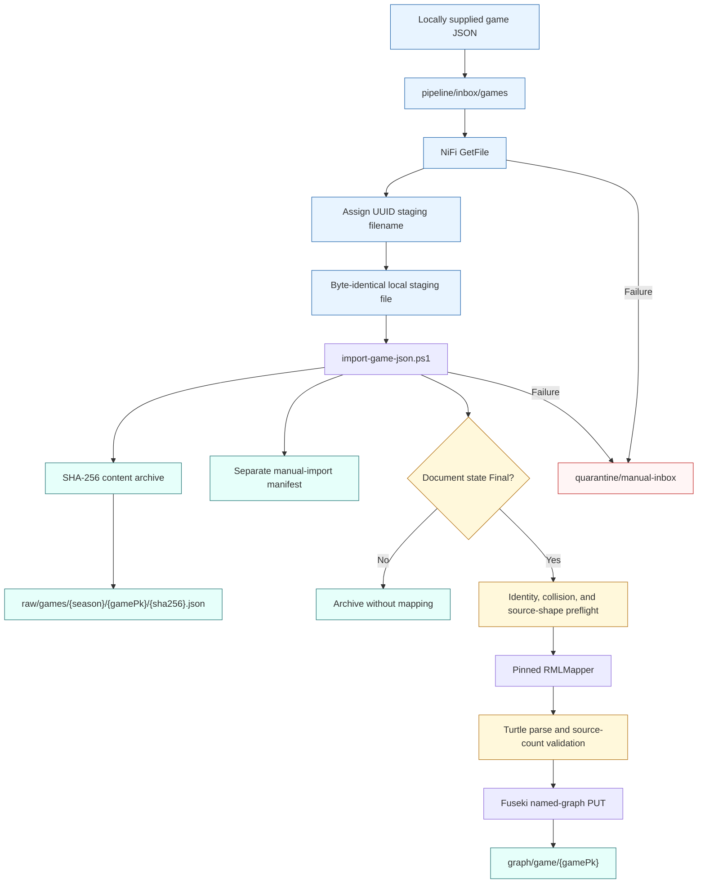

# Manual game import

This is the active operational path. NiFi observes only a local directory and makes no external HTTP request.

The source file is parsed for validation but never rewritten. Both the archive copy and the caller's original are checked against the pre-import SHA-256 hash.
