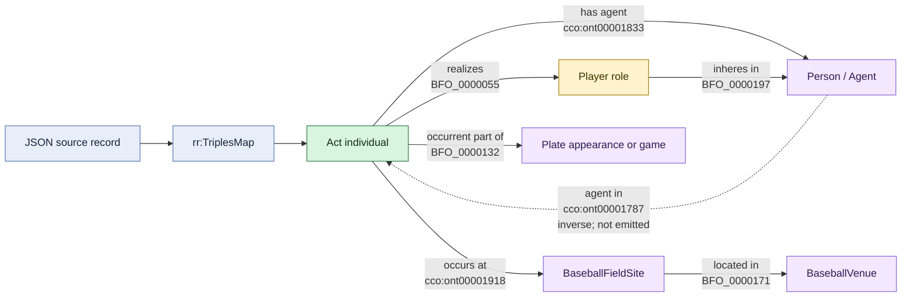

# Relation directions

## Direction assessment

| Assertion emitted by RML | Assessment |
| --- | --- |
| `act cco:ont00001833 person` | Correct: `has agent` has a process subject and agent object. |
| `act obo:BFO_0000055 role` | Correct: an occurrent realizes a realizable entity. |
| `role obo:BFO_0000197 person` | Correct: the specifically dependent role inheres in its bearer. |
| `act cco:ont00001918 fieldSite` | Correct: the process occurs at a site. |
| `fieldSite obo:BFO_0000171 venue` | Directionally valid: the field site is located in the material venue. |
| `act obo:BFO_0000132 context` | Correct subject direction for `occurrent part of`; runner acts use a coarser context than the other acts. |

The person-centric `person agent in act` direction is available as the inverse
of `has agent`, but the active instance graph emits only `act has agent person`.
Without inference, person-centric queries must use the inverse property path or
reverse triple pattern. Flipping the current assertion would be incorrect.
