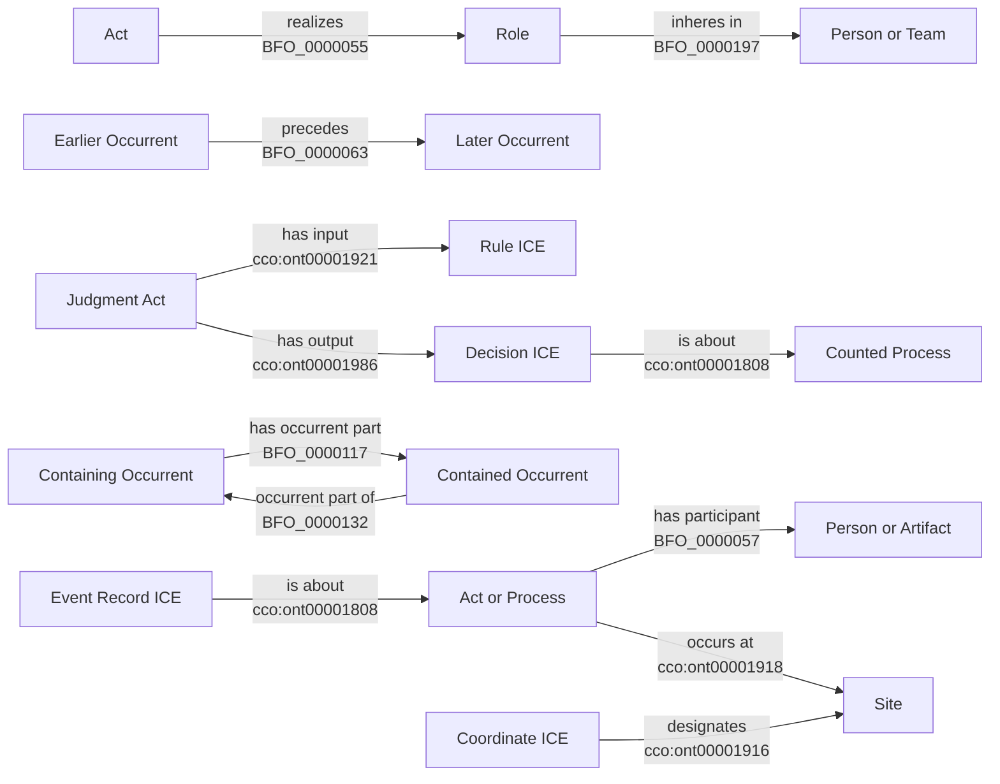

# RDF relation directions emitted by the RML

```mermaid
flowchart LR
    OCC["Act or Process"] -->|"has participant<br/>BFO_0000057"| CONT["Person or Artifact"]
    ACT["Act"] -->|"realizes<br/>BFO_0000055"| ROLE["Role"]
    ROLE -->|"inheres in<br/>BFO_0000197"| PERSON["Person or Team"]
    EARLY["Earlier Occurrent"] -->|"precedes<br/>BFO_0000063"| LATE["Later Occurrent"]
    PARENT["Containing Occurrent"] -->|"has occurrent part<br/>BFO_0000117"| CHILD["Contained Occurrent"]
    CHILD -->|"occurrent part of<br/>BFO_0000132"| PARENT
    OCC -->|"occurs at<br/>cco:ont00001918"| SITE["Site"]
    JUDGMENT["Judgment Act"] -->|"has input<br/>cco:ont00001921"| RULE["Rule ICE"]
    JUDGMENT -->|"has output<br/>cco:ont00001986"| DECISION["Decision ICE"]
    DECISION -->|"is about<br/>cco:ont00001808"| RESULT["Counted Process"]
    RECORD["Event Record ICE"] -->|"is about<br/>cco:ont00001808"| OCC
    COORD["Coordinate ICE"] -->|"designates<br/>cco:ont00001916"| SITE
```

These are the directions in the revised RML. Acts use `has participant` for agents and artifacts; the earlier `has agent` assertions were removed.
