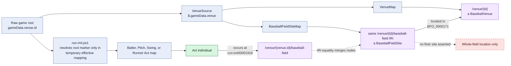

# Shared act-location construction

## Evaluation

Every mapped act uses the same location design. The act map does not join to
`BaseballFieldSiteMap`; it constructs the expected field-site IRI directly.
`BaseballFieldSiteMap` independently emits that same IRI from `VenueSource`, so
RDF identity joins the references.

For nested play, pitch, and runner sources, `$.gameData.venue.id` is not local
to the iterator record. The execution harness resolves the audited root marker
in a temporary mapping copy. This is an implementation dependency, not source
mutation.

The relation directions are sound, but the location is coarse: every act
occurs at the entire baseball-field site. Base sites, fair/foul territory, the
mound, and home plate are not selected from the current source mapping.
