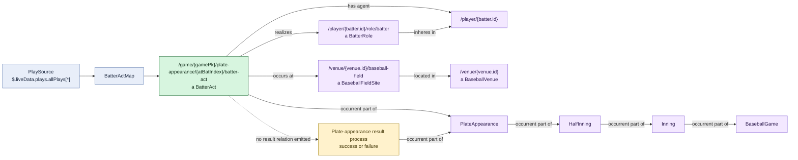

# Batter act

## Evaluation

- The act class and IRI are outcome-neutral: the same pattern is used whether
  the batter later hits, walks, strikes out, or records another result.
- Person, role, location, and plate-appearance containment are all explicit and
  directionally correct.
- A separate `SwingAct` individual may occur in the same plate appearance, but
  it is not related to this overall batter-act individual. Both independently
  point to the plate appearance, batter, role, and field site.
- Because `SwingAct` is already a subclass of `BatterAct`, the intended identity
  and parthood distinction between this broad act and each swing needs review.
