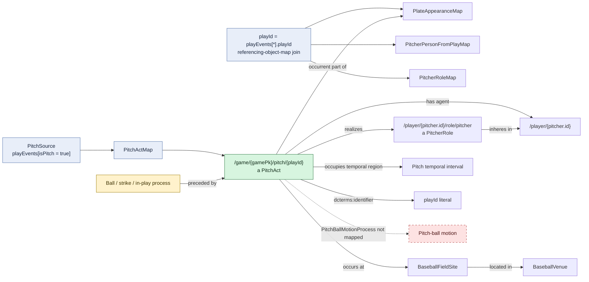

# Pitch act

## Evaluation

- The pitch act is outcome-neutral. Ball, strike, foul, and in-play status are
  represented by separate downstream process individuals.
- The person, role, and plate appearance depend on a processor-sensitive
  `playId` join. The field location uses the execution harness's materialized
  root venue marker.
- The temporal interval and source `playId` are stronger identity support than
  the other mapped act patterns receive.
- The ontology distinguishes a `PitchAct` from ensuing ball motion, but the RML
  does not instantiate `PitchBallMotionProcess`.
