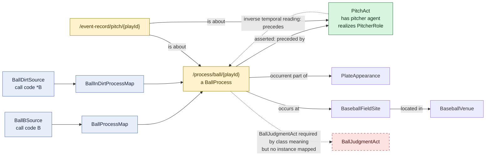

# Called ball and ball-in-dirt pattern

## Evaluation

Codes `B` and `*B` use exactly the same RDF identity and relation pattern, so
they are shown once. The pitcher remains agent of the neutral `PitchAct`, not
agent of the institutional `BallProcess`. This separation is sound. The missing
judgment-act instance means the ABox does not explicitly realize the ontology's
full institutional classification pattern.
