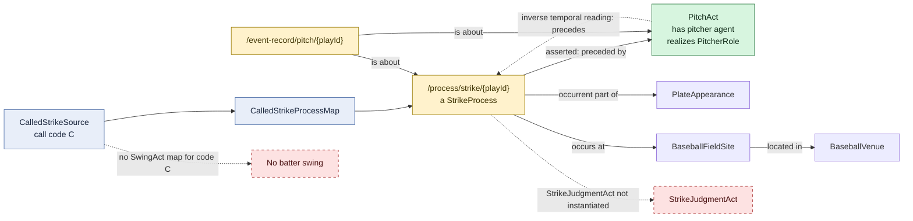

# Called strike without a swing

## Evaluation

This is materially different from a swinging strike: the mapping creates no
`SwingAct`. The batter therefore has no agent relation for this pitch event,
which is appropriate if the source code reliably means the batter did not
swing. The institutional strike status remains separate from the pitcher's act.
