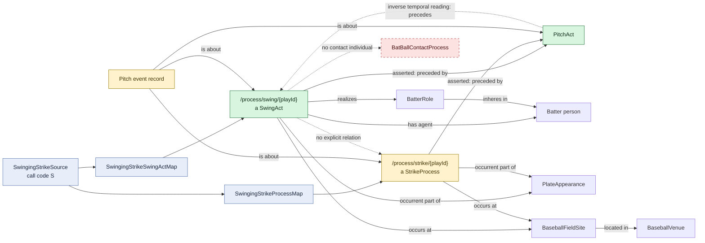

# Swinging strike

## Evaluation

- The failed contact objective is not baked into `SwingAct`; the separate
  `StrikeProcess` carries the institutional outcome.
- The source record is about both individuals, but the RML does not directly
  relate the swing to the strike process. Both are only `preceded by` the pitch
  and are parts of the same plate appearance.
- The absence of a contact individual correctly distinguishes this pattern
  from foul, foul-tip, and in-play swings.
