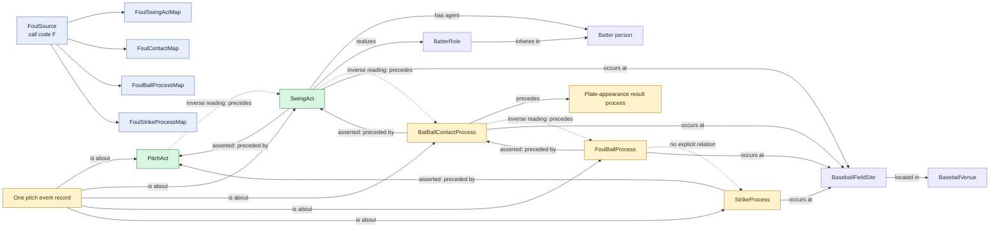

# Foul swing

## Evaluation

- Contact success is represented by a separate physical process; the swing
  remains the same intentional act class used for a miss or a fair ball.
- Foul and strike are separate institutional process individuals, which avoids
  conflating the physical contact with either counted status.
- The graph does not directly connect `FoulBallProcess` to `StrikeProcess`.
  Their shared source record is the only explicit common node.
- The contact is also asserted to precede the eventual plate-appearance result,
  which may occur several pitches later.
- Review whether separate foul and strike process individuals are the intended
  two institutional classifications or whether one should be explicitly
  related to the other. Counting both generically as pitch outcomes could
  otherwise double-count one source pitch.
