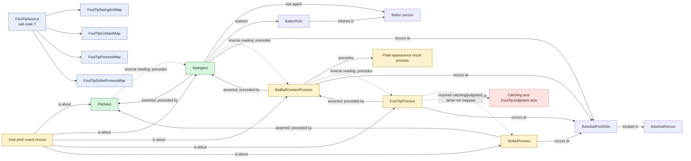

# Foul-tip swing

## Evaluation

This pattern is structurally close to the ordinary foul pattern but is kept
separate because `FoulTipProcess` has materially different rule content: the
ball remains in play and the ontology definition refers to catching and an
authorized foul-tip judgment. Neither the catching process/act nor the
judgment act is instantiated by the RML.

The same source pitch also creates a separate `StrikeProcess`, even though the
`FoulTipProcess` definition already says it is institutionally counted as a
strike. That may be intentional decomposition, but the two status processes
currently have no explicit relation and should be reviewed for duplication.
