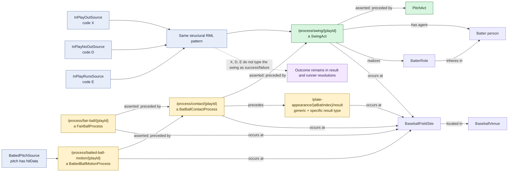

# In-play swing: shared X, D, and E pattern

## Evaluation

The X, D, and E filtered maps are exactly the same RDF design pattern, so one
generic diagram is sufficient. Their source names mention out, no-out, and
runs, but every variant emits the same success-neutral `SwingAct`, contact,
and fair-ball structure. Final institutional success or failure comes from the
plate-appearance result and runner-resolution mappings.

`BattedBallMotionProcess` is selected independently by the presence of
`hitData`; it is not guaranteed solely by membership in an X, D, or E source.

## Identical map variants

| Call code | Swing map | Contact map | Fair-ball map |
| --- | --- | --- | --- |
| `X` | `InPlayOutSwingActMap` | `InPlayOutContactMap` | `InPlayOutFairBallMap` |
| `D` | `InPlayNoOutSwingActMap` | `InPlayNoOutContactMap` | `InPlayNoOutFairBallMap` |
| `E` | `InPlayRunsSwingActMap` | `InPlayRunsContactMap` | `InPlayRunsFairBallMap` |

Each family also has a record-about map using the shared pitch event-record IRI.
`BattedBallMotionMap` is common to any pitch record containing `hitData`.
