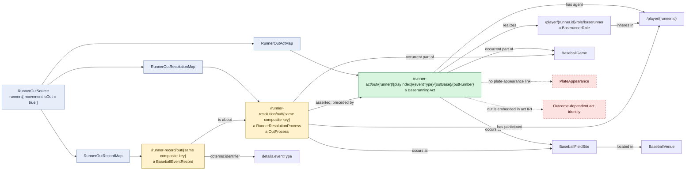

# Runner out

## Evaluation

The class separation is good: the runner performs a neutral `BaserunningAct`,
and a distinct `OutProcess` records the unsuccessful institutional resolution.
However, the act is selected only from an out record and its IRI contains
`/out/`. Success is therefore absent from the class but baked into identity.

The act and resolution are parts of the game rather than the enclosing plate
appearance. This prevents direct traversal from a runner out to the batter act
and plate-appearance result that supplied its play context.
