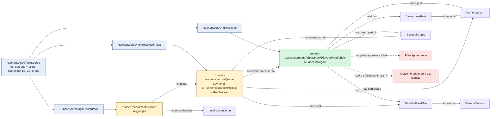

# Runner scores from an origin state

## Evaluation

This branch exists because the runner record lacks a normal base in
`movement.start`. It uses the literal path segment `origin` to keep the
composite identity distinct. The act/result separation is semantically useful,
but `/score/` still makes the act identity dependent on its successful outcome.
The broad filter also groups every non-1B/2B/3B start value into one origin
pattern and therefore deserves testing against more source shapes.
