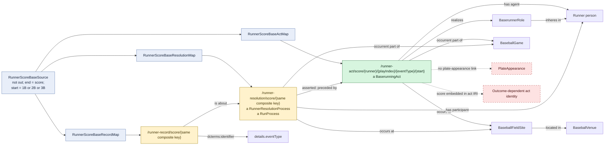

# Runner scores from a recorded base

## Evaluation

This is separate from the origin-score pattern because the starting base is a
material part of the composite identity. It still types the act neutrally and
the resolution as `RunProcess`, but the `/score/` act path encodes the result.
The repeated `&&`/`||` JSONPath filter also relies on processor operator
precedence and should remain in compatibility tests.
