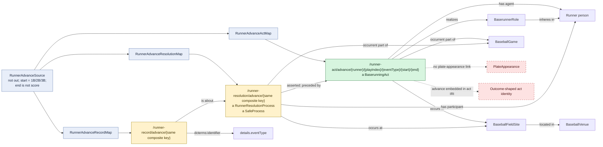

# Runner advances safely from a recorded base

## Evaluation

This is materially distinct from reach because both starting and ending bases
participate in identity. As with reach, successful status is represented by a
separate `SafeProcess`, but the act path still depends on the movement category
and the RML has no direct plate-appearance edge.
