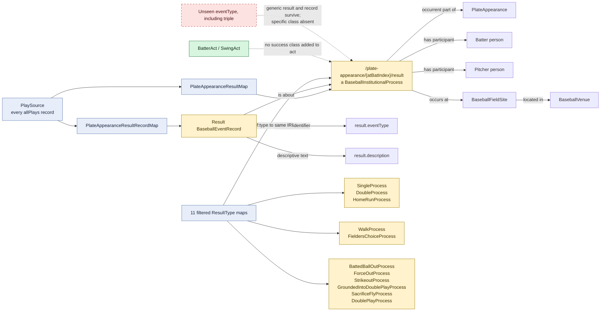

# Plate-appearance result: generic identity with specific typing

## Specific-type overlay

| Source `result.eventType` | Additional type on the generic result IRI |
| --- | --- |
| `home_run` | `HomeRunProcess` |
| `double` | `DoubleProcess` |
| `single` | `SingleProcess` |
| `walk` | `WalkProcess` |
| `fielders_choice` | `FieldersChoiceProcess` |
| `field_out` | `BattedBallOutProcess` |
| `force_out` | `ForceOutProcess` |
| `strikeout` | `StrikeoutProcess` |
| `grounded_into_double_play` | `GroundedIntoDoublePlayProcess` |
| `sac_fly` | `SacrificeFlyProcess` |
| `double_play` | `DoublePlayProcess` |

## Evaluation

This is a strong success-neutral identity pattern. Every plate appearance gets
one generic result IRI, and reviewed source values add institutional outcome
types to that same individual. Hits, outs, walks, and productive outs do not
change the identity or class of the batter's act.

The grouping above is descriptive, not a binary success taxonomy. For example,
a sacrifice fly is an out that may achieve the batter's game objective, and a
fielder's choice may be safe for the batter while producing another runner's
out. The RML correctly preserves those as source-specific result processes.
