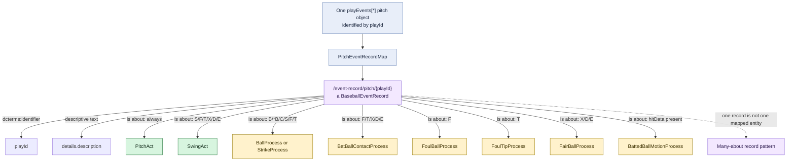

# Shared pitch event record

## Evaluation

The repeated `*RecordAboutMap` triples all reuse the same event-record IRI.
That is coherent if the MLB pitch object is interpreted as one compound source
record describing several distinct aspects of an event. It would be incorrect
to assume one event record identifies exactly one act or process.

This shared node sometimes supplies the only explicit connection between
parallel institutional processes—for example, the foul-ball and strike
processes created from the same `F` call. Whether that is sufficient should be
decided separately from record identity.
