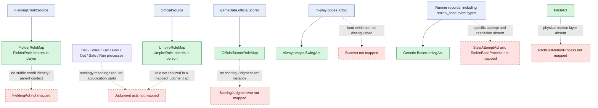

# Human acts not instantiated by the direct RML

## Evaluation

- Fielding credits currently license only a career `FielderRole`; no person is
  connected as agent of a fielding act.
- Umpires and the official scorer bear roles, but those roles have no mapped
  realization in judgment acts. Institutional result processes are typed
  without explicit judgment-act parts in the instance graph.
- Every X/D/E event becomes `SwingAct`. If the source includes bunts under
  those codes, the mapping overstates swinging and misses `BuntAct`.
- Stolen-base ontology concepts exist, but the direct runner mapping remains
  generic and relies on source identifiers for stolen-base queries.

These are mapping and source-identity gaps. They are not authorization to alter
the ontology; the repository guardrail leaves ontology decisions to the owner.
