# Direction and design correction candidates

```mermaid
flowchart TB
    REVIEW["Person–act–location review"] --> KEEP["Keep current direction"]
    REVIEW --> CORRECT["Candidate mapping corrections"]
    REVIEW --> DECIDE["Ontology/source decision required"]

    KEEP --> K1["Act has agent Person"]
    KEEP --> K2["Act realizes Role"]
    KEEP --> K3["Role inheres in Person"]
    KEEP --> K4["Act occurs at Field Site"]
    KEEP --> K5["Field Site located in Venue"]
    KEEP --> K6["Batter, Pitch, Swing acts remain outcome-neutral"]

    CORRECT --> C1["Give runner acts outcome-neutral identity"]
    CORRECT --> C2["Link runner act and resolution to Plate Appearance"]
    CORRECT --> C3["Clarify relation between overall BatterAct and each SwingAct"]
    CORRECT --> C4["Connect swing/contact branches to institutional outcomes where justified"]
    CORRECT --> C5["Expose inverse person-centric navigation in query/API layer"]

    DECIDE --> D1["Reliable runner parent and record identity"]
    DECIDE --> D2["Bunt recognition from source"]
    DECIDE --> D3["Fielding-act identity and parent scope"]
    DECIDE --> D4["Judgment acts and responsible official"]
    DECIDE --> D5["Specific field sub-sites versus whole-field location"]

    classDef keep fill:#d7f5df,stroke:#24733b,color:#102a18;
    classDef correct fill:#fff2cc,stroke:#997a00,color:#3d3100;
    classDef decide fill:#fde2e2,stroke:#a33,color:#4a1111;
    class KEEP,K1,K2,K3,K4,K5,K6 keep;
    class CORRECT,C1,C2,C3,C4,C5 correct;
    class DECIDE,D1,D2,D3,D4,D5 decide;
```

## Recommended review order

1. Do **not** reverse the current `has agent`, `realizes`, `inheres in`, or
   `occurs at` triples. Their subject/object direction matches BFO and CCO.
2. Decide what the separately minted plate-appearance-level `BatterAct` means
   relative to each `SwingAct`. They currently duplicate agent, role, location,
   and context without a relation between the individuals.
3. Redesign runner-act identity if a stable outcome-neutral key can be obtained.
   Keep `OutProcess`, `SafeProcess`, and `RunProcess` as separate resolutions.
4. Recover runner-to-plate-appearance context only through a processor-proven,
   source-supported join; do not invent an index.
5. Decide whether the source supports bunts, fielding acts, and explicit
   adjudication acts before adding those instance patterns.
6. Treat whole-field `occurs at` as valid but coarse. More specific locations
   require source evidence and approved site patterns.

The mapping can offer person-first traversal without duplicating triples by
using `^cco:ont00001833` in SPARQL or the declared `agent in` inverse when
reasoning is enabled.
