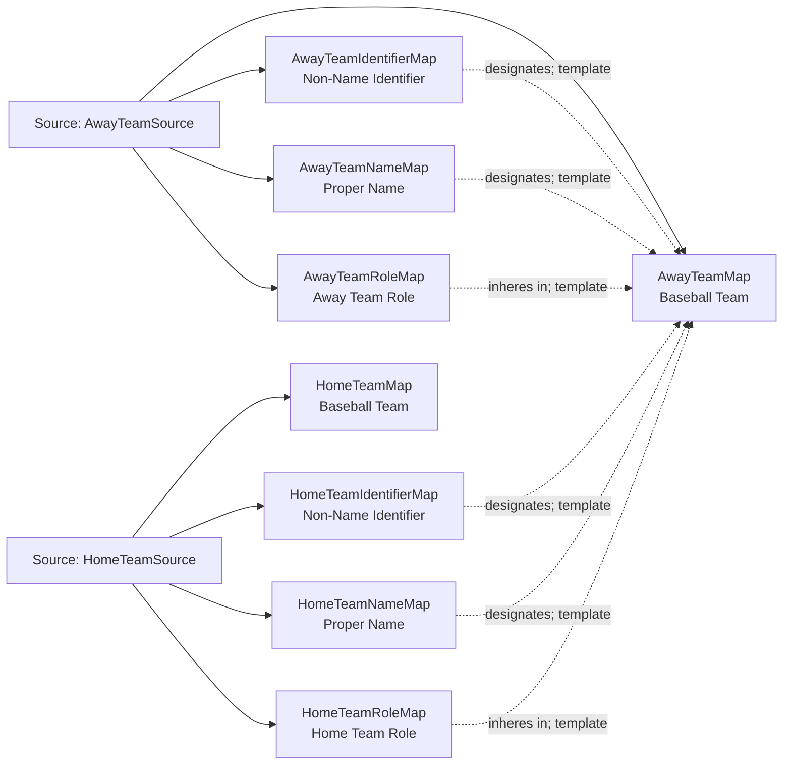

<!-- Generated by scripts/generate_rml_mermaid.py; do not edit. -->
<!-- Mapping SHA-256: 57a5cb1a54e46ee26b27f101cb1468292932df060b1f72c51331c0d029f8c2b5 -->

# Team participation - MLB direct RML

Home and away teams participate in a game while their contextual team roles remain distinct from the teams themselves.

Solid relation arrows are explicit parent-triples-map joins. Dotted relation arrows are IRI-template matches inferred by the reviewer from the actual RML templates. Cross-pattern targets are listed in the table rather than drawn, keeping the diagram small.

## Logical sources

| Source | Execution file | JSONPath iterator | Maps in this review |
| --- | --- | --- | ---: |
| `AwayTeamSource` | `game.json` | `$.gameData.teams.away` | 4 |
| `HomeTeamSource` | `game.json` | `$.gameData.teams.home` | 4 |

## Triples maps

| Triples map | Subject class | Emitted relations | Cross-pattern targets |
| --- | --- | --- | --- |
| `AwayTeamMap` | Baseball Team | label | none |
| `AwayTeamIdentifierMap` | Non-Name Identifier | designates, has text value | none |
| `AwayTeamNameMap` | Proper Name | designates, has text value | none |
| `AwayTeamRoleMap` | Away Team Role | has realization, inheres in | has realization -> GameMap (template) |
| `HomeTeamMap` | Baseball Team | label | none |
| `HomeTeamIdentifierMap` | Non-Name Identifier | designates, has text value | none |
| `HomeTeamNameMap` | Proper Name | designates, has text value | none |
| `HomeTeamRoleMap` | Home Team Role | has realization, inheres in | has realization -> GameMap (template) |
