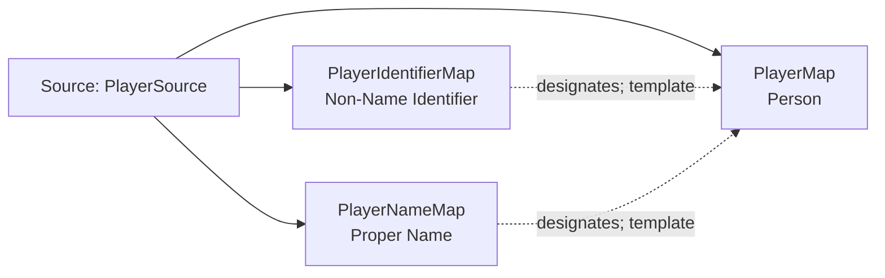

<!-- Generated by scripts/generate_rml_mermaid.py; do not edit. -->
<!-- Mapping SHA-256: afc5ccb32c5b86811c4960eda0c0809e2e3daaa57d51b4d067d7b54dc4b6e50c -->

# Player identity - MLB direct RML

A player person is designated by identifier and name information content entities.

Solid relation arrows are explicit parent-triples-map joins. Dotted relation arrows are IRI-template matches inferred by the reviewer from the actual RML templates. Cross-pattern targets are listed in the table rather than drawn, keeping the diagram small.

## Logical sources

| Source | Execution file | JSONPath iterator | Maps in this review |
| --- | --- | --- | ---: |
| `PlayerSource` | `game.json` | `$.gameData.players.*` | 3 |

## Triples maps

| Triples map | Subject class | Emitted relations | Cross-pattern targets |
| --- | --- | --- | --- |
| `PlayerMap` | Person | label | none |
| `PlayerIdentifierMap` | Non-Name Identifier | designates, has text value | none |
| `PlayerNameMap` | Proper Name | designates, has text value | none |
