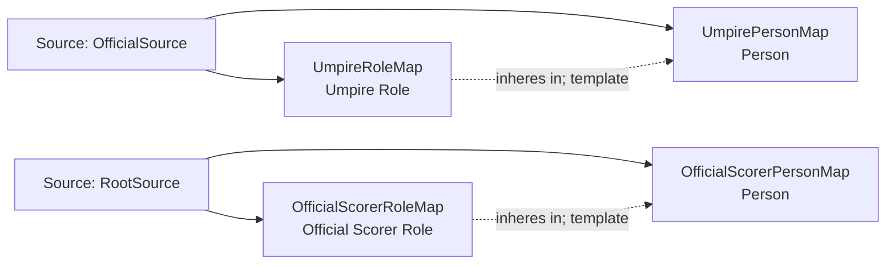

<!-- Generated by scripts/generate_rml_mermaid.py; do not edit. -->
<!-- Mapping SHA-256: a288d8d9e8e638468897751f8eda557afe2f40c2d055fa2acb378682b778531d -->

# Game officials - MLB direct RML

Umpires and the official scorer are persons bearing game-scoped roles.

Solid relation arrows are explicit parent-triples-map joins. Dotted relation arrows are IRI-template matches inferred by the reviewer from the actual RML templates. Cross-pattern targets are listed in the table rather than drawn, keeping the diagram small.

## Logical sources

| Source | JSONPath iterator | Maps in this review |
| --- | --- | ---: |
| `OfficialSource` | `$.liveData.boxscore.officials[*]` | 2 |
| `RootSource` | `$` | 2 |

## Triples maps

| Triples map | Subject class | Emitted relations | Cross-pattern targets |
| --- | --- | --- | --- |
| `UmpirePersonMap` | Person | label | none |
| `UmpireRoleMap` | Umpire Role | has realization, inheres in | has realization -> GameMap (template) |
| `OfficialScorerPersonMap` | Person | label | none |
| `OfficialScorerRoleMap` | Official Scorer Role | has realization, inheres in | has realization -> GameMap (template) |
