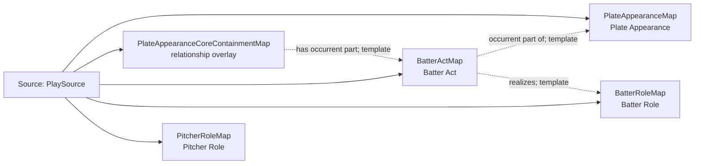

<!-- Generated by scripts/generate_rml_mermaid.py; do not edit. -->
<!-- Mapping SHA-256: bc17e2b9f57294d3456d628659686c0b73a95287999ec6cb26d7fb99be7f00f7 -->

# Plate appearance and player acts - MLB direct RML

A plate appearance contains a batter act and pitch acts, with batter and pitcher persons participating through contextual roles.

Solid relation arrows are explicit parent-triples-map joins. Dotted relation arrows are IRI-template matches inferred by the reviewer from the actual RML templates. Cross-pattern targets are listed in the table rather than drawn, keeping the diagram small.

## Logical sources

| Source | Execution file | JSONPath iterator | Maps in this review |
| --- | --- | --- | ---: |
| `PlaySource` | `game.json` | `$.liveData.plays.allPlays[*]` | 5 |

## Triples maps

| Triples map | Subject class | Emitted relations | Cross-pattern targets |
| --- | --- | --- | --- |
| `PlateAppearanceMap` | Plate Appearance | has participant, occupies temporal region, occurrent part of, occurs at | has participant -> Player (template), occupies temporal region -> PlateAppearanceIntervalMap (template), occurrent part of -> HalfInningMap (template), occurs at -> Baseball Field (template) |
| `PlateAppearanceCoreContainmentMap` | relationship overlay | has occurrent part | has occurrent part -> PlateAppearanceResultMap (template) |
| `BatterActMap` | Batter Act | has participant, occurrent part of, occurs at, realizes | has participant -> Player (template), occurs at -> Baseball Field (template) |
| `BatterRoleMap` | Batter Role | inheres in | inheres in -> Player (template) |
| `PitcherRoleMap` | Pitcher Role | inheres in | inheres in -> Player (template) |
