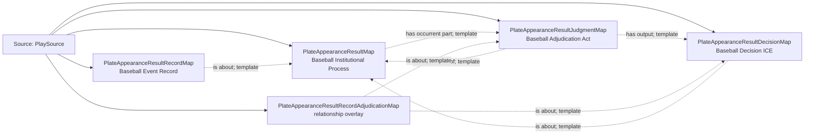

<!-- Generated by scripts/generate_rml_mermaid.py; do not edit. -->
<!-- Mapping SHA-256: 9a3db3cb5b1910df091581beef2527d2be68ec9d03699dce645c1b3a20bbe611 -->

# Plate appearance result and adjudication - MLB direct RML

Every plate-appearance result is a distinct institutional process with an adjudication act, decision, and event record.

Solid relation arrows are explicit parent-triples-map joins. Dotted relation arrows are IRI-template matches inferred by the reviewer from the actual RML templates. Cross-pattern targets are listed in the table rather than drawn, keeping the diagram small.

## Logical sources

| Source | Execution file | JSONPath iterator | Maps in this review |
| --- | --- | --- | ---: |
| `PlaySource` | `game.json` | `$.liveData.plays.allPlays[*]` | 5 |

## Triples maps

| Triples map | Subject class | Emitted relations | Cross-pattern targets |
| --- | --- | --- | --- |
| `PlateAppearanceResultMap` | Baseball Institutional Process | has occurrent part, has participant, occurrent part of, occurs at | has participant -> Player (template), occurrent part of -> PlateAppearanceMap (template), occurs at -> Baseball Field (template) |
| `PlateAppearanceResultJudgmentMap` | Baseball Adjudication Act | has output, occurrent part of, occurs at | occurs at -> Baseball Field (template) |
| `PlateAppearanceResultDecisionMap` | Baseball Decision ICE | is about | none |
| `PlateAppearanceResultRecordMap` | Baseball Event Record | has text value, identifier, is about | none |
| `PlateAppearanceResultRecordAdjudicationMap` | relationship overlay | is about | none |
