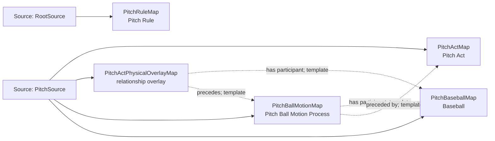

<!-- Generated by scripts/generate_rml_mermaid.py; do not edit. -->
<!-- Mapping SHA-256: a288d8d9e8e638468897751f8eda557afe2f40c2d055fa2acb378682b778531d -->

# Pitch physical chain - MLB direct RML

A pitch act precedes a pitch-ball-motion process involving a pitch-scoped baseball and governed by the pitch rule.

Solid relation arrows are explicit parent-triples-map joins. Dotted relation arrows are IRI-template matches inferred by the reviewer from the actual RML templates. Cross-pattern targets are listed in the table rather than drawn, keeping the diagram small.

## Logical sources

| Source | JSONPath iterator | Maps in this review |
| --- | --- | ---: |
| `PitchSource` | `$.liveData.plays.allPlays[*].playEvents[?(@.isPitch == true)]` | 4 |
| `RootSource` | `$` | 1 |

## Triples maps

| Triples map | Subject class | Emitted relations | Cross-pattern targets |
| --- | --- | --- | --- |
| `PitchActMap` | Pitch Act | has participant, identifier, occupies temporal region, occurrent part of, occurs at, realizes | has participant -> PitcherPersonFromPlayMap (join), occupies temporal region -> PitchIntervalMap (template), occurrent part of -> PlateAppearanceMap (join), occurs at -> Baseball Field (template), realizes -> PitcherRoleMap (join) |
| `PitchActPhysicalOverlayMap` | relationship overlay | has participant, precedes | none |
| `PitchBallMotionMap` | Pitch Ball Motion Process | has participant, occurrent part of, occurs at, preceded by | occurrent part of -> PlateAppearanceMap (join), occurs at -> Baseball Field (template) |
| `PitchBaseballMap` | Baseball | type assertion only | none |
| `PitchRuleMap` | Pitch Rule | type assertion only | none |
