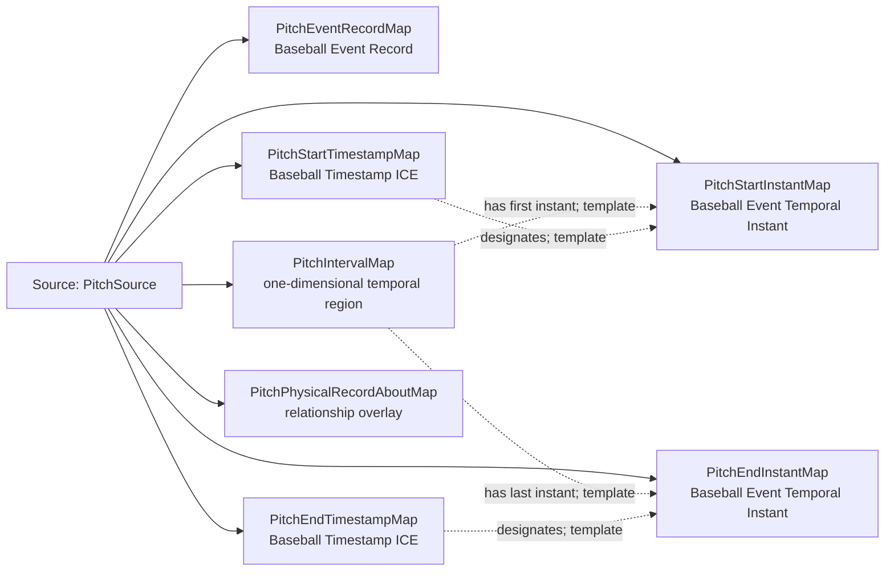

<!-- Generated by scripts/generate_rml_mermaid.py; do not edit. -->
<!-- Mapping SHA-256: a288d8d9e8e638468897751f8eda557afe2f40c2d055fa2acb378682b778531d -->

# Pitch time and record - MLB direct RML

A pitch occupies a temporal interval, has timestamped endpoints, and is described by a separate event record.

Solid relation arrows are explicit parent-triples-map joins. Dotted relation arrows are IRI-template matches inferred by the reviewer from the actual RML templates. Cross-pattern targets are listed in the table rather than drawn, keeping the diagram small.

## Logical sources

| Source | JSONPath iterator | Maps in this review |
| --- | --- | ---: |
| `PitchSource` | `$.liveData.plays.allPlays[*].playEvents[?(@.isPitch == true)]` | 7 |

## Triples maps

| Triples map | Subject class | Emitted relations | Cross-pattern targets |
| --- | --- | --- | --- |
| `PitchEventRecordMap` | Baseball Event Record | has text value, identifier, is about | is about -> PitchActMap (template) |
| `PitchIntervalMap` | one-dimensional temporal region | has first instant, has last instant, temporal part of | temporal part of -> PlateAppearanceIntervalMap (join) |
| `PitchStartInstantMap` | Baseball Event Temporal Instant | type assertion only | none |
| `PitchStartTimestampMap` | Baseball Timestamp ICE | designates, has datetime value, is about | is about -> PitchActMap (template) |
| `PitchEndInstantMap` | Baseball Event Temporal Instant | type assertion only | none |
| `PitchEndTimestampMap` | Baseball Timestamp ICE | designates, has datetime value, is about | is about -> PitchActMap (template) |
| `PitchPhysicalRecordAboutMap` | relationship overlay | is about | is about -> PitchBallMotionMap (template), is about -> PitchBaseballMap (template) |
