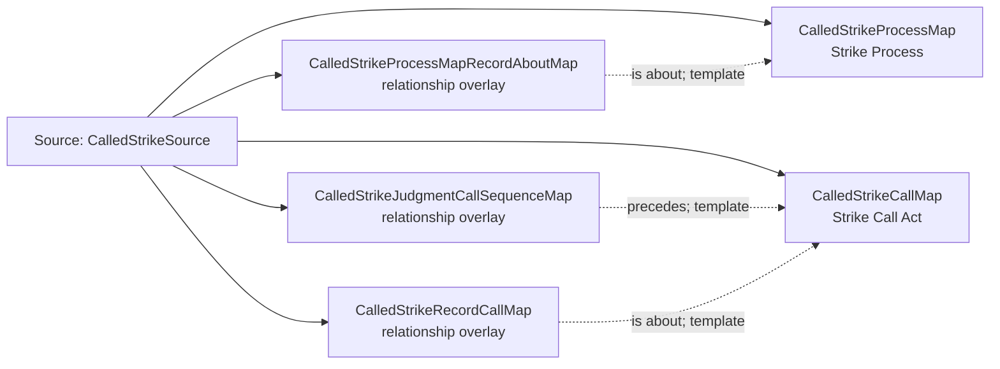

<!-- Generated by scripts/generate_rml_mermaid.py; do not edit. -->
<!-- Mapping SHA-256: ab85db49a66adbcba8c5e82535e3a1824626785795b7c5e3eb7169676c38b3d0 -->

# Called strike - MLB direct RML

A called strike process is followed by an explicit strike call act that consumes the strike decision.

Solid relation arrows are explicit parent-triples-map joins. Dotted relation arrows are IRI-template matches inferred by the reviewer from the actual RML templates. Cross-pattern targets are listed in the table rather than drawn, keeping the diagram small.

## Logical sources

| Source | Execution file | JSONPath iterator | Maps in this review |
| --- | --- | --- | ---: |
| `CalledStrikeSource` | `game-context.json` | `$.liveData.plays.allPlays[*].playEvents[?(@.isPitch == true && @.details.call.code == 'C')]` | 5 |

## Triples maps

| Triples map | Subject class | Emitted relations | Cross-pattern targets |
| --- | --- | --- | --- |
| `CalledStrikeProcessMap` | Strike Process | occurrent part of, occurs at, preceded by | occurrent part of -> Plate Appearance (template), occurs at -> Baseball Field (template), preceded by -> PitchBallMotionMap (template) |
| `CalledStrikeProcessMapRecordAboutMap` | relationship overlay | is about | none |
| `CalledStrikeCallMap` | Strike Call Act | has input, has participant, occurrent part of, realizes | has input -> CountedFoulStrikeDecisionMap (template), has participant -> Person (template), occurrent part of -> Plate Appearance (template), realizes -> Umpire (template) |
| `CalledStrikeJudgmentCallSequenceMap` | relationship overlay | precedes | none |
| `CalledStrikeRecordCallMap` | relationship overlay | is about | none |
