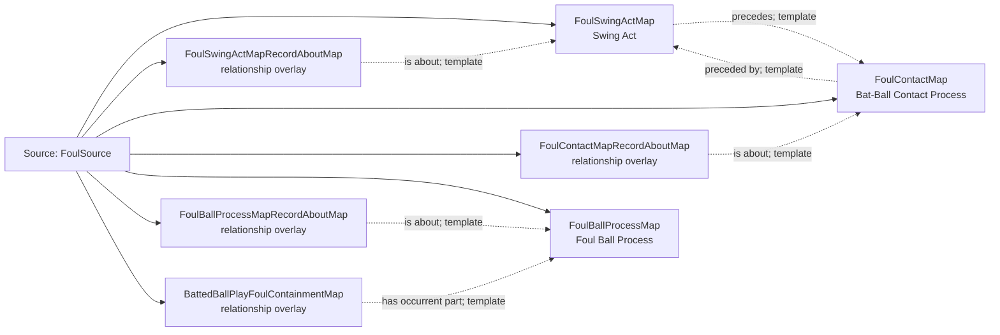

<!-- Generated by scripts/generate_rml_mermaid.py; do not edit. -->
<!-- Mapping SHA-256: a288d8d9e8e638468897751f8eda557afe2f40c2d055fa2acb378682b778531d -->

# Foul-ball physical chain - MLB direct RML

A swing and contact precede the foul-ball process, while the batted-ball play and event record retain the physical evidence.

Solid relation arrows are explicit parent-triples-map joins. Dotted relation arrows are IRI-template matches inferred by the reviewer from the actual RML templates. Cross-pattern targets are listed in the table rather than drawn, keeping the diagram small.

## Logical sources

| Source | JSONPath iterator | Maps in this review |
| --- | --- | ---: |
| `FoulSource` | `$.liveData.plays.allPlays[*].playEvents[?(@.isPitch == true && @.details.call.code == 'F')]` | 7 |

## Triples maps

| Triples map | Subject class | Emitted relations | Cross-pattern targets |
| --- | --- | --- | --- |
| `FoulSwingActMap` | Swing Act | has participant, occurrent part of, occurs at, preceded by, precedes, realizes | has participant -> BatterPersonFromPlayMap (join), has participant -> SwingBaseballBatMap (template), occurrent part of -> BatterActMap (join), occurrent part of -> PlateAppearanceMap (join), occurs at -> Baseball Field (template), preceded by -> PitchActMap (template), realizes -> BatterRoleMap (join) |
| `FoulSwingActMapRecordAboutMap` | relationship overlay | is about | none |
| `FoulContactMap` | Bat-Ball Contact Process | occurrent part of, occurs at, preceded by, precedes | occurrent part of -> PlateAppearanceMap (join), occurs at -> Baseball Field (template), precedes -> BattedBallMotionMap (template) |
| `FoulContactMapRecordAboutMap` | relationship overlay | is about | none |
| `FoulBallProcessMap` | Foul Ball Process | occurrent part of, occurs at, preceded by | occurrent part of -> PlateAppearanceMap (join), occurs at -> Baseball Field (template), preceded by -> BattedBallMotionMap (template) |
| `FoulBallProcessMapRecordAboutMap` | relationship overlay | is about | none |
| `BattedBallPlayFoulContainmentMap` | relationship overlay | has occurrent part | none |
