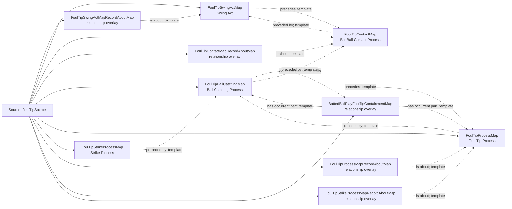

<!-- Generated by scripts/generate_rml_mermaid.py; do not edit. -->
<!-- Mapping SHA-256: bc17e2b9f57294d3456d628659686c0b73a95287999ec6cb26d7fb99be7f00f7 -->

# Foul-tip physical chain and shared identity - MLB direct RML

A foul tip follows swing and contact, includes catching, and is one institutional-process individual typed as both foul tip and strike.

Solid relation arrows are explicit parent-triples-map joins. Dotted relation arrows are IRI-template matches inferred by the reviewer from the actual RML templates. Cross-pattern targets are listed in the table rather than drawn, keeping the diagram small.

## Logical sources

| Source | Execution file | JSONPath iterator | Maps in this review |
| --- | --- | --- | ---: |
| `FoulTipSource` | `game-context.json` | `$.liveData.plays.allPlays[*].playEvents[?(@.isPitch == true && @.details.call.code == 'T')]` | 10 |

## Triples maps

| Triples map | Subject class | Emitted relations | Cross-pattern targets |
| --- | --- | --- | --- |
| `FoulTipSwingActMap` | Swing Act | has participant, occurrent part of, occurs at, preceded by, precedes, realizes | has participant -> Player (template), has participant -> SwingBaseballBatMap (template), occurrent part of -> Batter Act (template), occurrent part of -> Plate Appearance (template), occurs at -> Baseball Field (template), preceded by -> PitchActMap (template), realizes -> Batter (template) |
| `FoulTipSwingActMapRecordAboutMap` | relationship overlay | is about | none |
| `FoulTipContactMap` | Bat-Ball Contact Process | occurrent part of, occurs at, preceded by, precedes | occurrent part of -> Plate Appearance (template), occurs at -> Baseball Field (template), precedes -> BattedBallMotionMap (template) |
| `FoulTipContactMapRecordAboutMap` | relationship overlay | is about | none |
| `FoulTipBallCatchingMap` | Ball Catching Process | has participant, occurrent part of, preceded by, precedes | has participant -> PitchBaseballMap (template) |
| `FoulTipProcessMap` | Foul Tip Process | occurrent part of, occurs at, preceded by | occurrent part of -> Plate Appearance (template), occurs at -> Baseball Field (template) |
| `FoulTipStrikeProcessMap` | Strike Process | occurrent part of, occurs at, preceded by | occurrent part of -> Plate Appearance (template), occurs at -> Baseball Field (template) |
| `FoulTipProcessMapRecordAboutMap` | relationship overlay | is about | none |
| `FoulTipStrikeProcessMapRecordAboutMap` | relationship overlay | is about | none |
| `BattedBallPlayFoulTipContainmentMap` | relationship overlay | has occurrent part | none |
