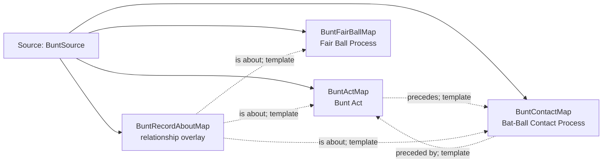

<!-- Generated by scripts/generate_rml_mermaid.py; do not edit. -->
<!-- Mapping SHA-256: afc5ccb32c5b86811c4960eda0c0809e2e3daaa57d51b4d067d7b54dc4b6e50c -->

# Bunt contact - MLB direct RML

A bunt act precedes contact and fair-ball classification without collapsing the act into its resulting processes.

Solid relation arrows are explicit parent-triples-map joins. Dotted relation arrows are IRI-template matches inferred by the reviewer from the actual RML templates. Cross-pattern targets are listed in the table rather than drawn, keeping the diagram small.

## Logical sources

| Source | Execution file | JSONPath iterator | Maps in this review |
| --- | --- | --- | ---: |
| `BuntSource` | `game-context.json` | `$.liveData.plays.allPlays[?(@.result.eventType == 'sac_bunt')].playEvents[?(@.isPitch == true && @.details.call.code == 'X' \|\| @.isPitch == true && @.details.call.code == 'D' \|\| @.isPitch == true && @.details.call.code == 'E')]` | 4 |

## Triples maps

| Triples map | Subject class | Emitted relations | Cross-pattern targets |
| --- | --- | --- | --- |
| `BuntActMap` | Bunt Act | has participant, occurrent part of, occurs at, preceded by, precedes, realizes | has participant -> Player (template), has participant -> SwingBaseballBatMap (template), occurrent part of -> Batter Act (template), occurrent part of -> Plate Appearance (template), occurs at -> Baseball Field (template), preceded by -> PitchActMap (template), realizes -> Batter (template) |
| `BuntContactMap` | Bat-Ball Contact Process | occurrent part of, occurs at, preceded by, precedes | occurrent part of -> Plate Appearance (template), occurs at -> Baseball Field (template), precedes -> BattedBallMotionMap (template) |
| `BuntFairBallMap` | Fair Ball Process | occurrent part of, occurs at, preceded by | occurrent part of -> Plate Appearance (template), occurs at -> Baseball Field (template), preceded by -> BattedBallMotionMap (template) |
| `BuntRecordAboutMap` | relationship overlay | is about | none |
