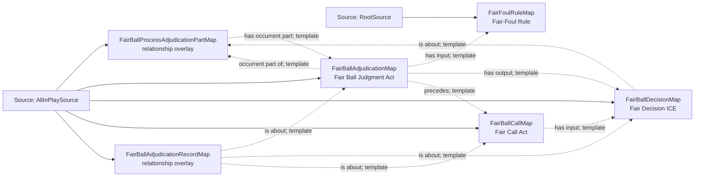

<!-- Generated by scripts/generate_rml_mermaid.py; do not edit. -->
<!-- Mapping SHA-256: a288d8d9e8e638468897751f8eda557afe2f40c2d055fa2acb378682b778531d -->

# Fair-ball adjudication - MLB direct RML

A fair-ball process contains a judgment that uses the fair/foul rule, produces a decision, and precedes a call act.

Solid relation arrows are explicit parent-triples-map joins. Dotted relation arrows are IRI-template matches inferred by the reviewer from the actual RML templates. Cross-pattern targets are listed in the table rather than drawn, keeping the diagram small.

## Logical sources

| Source | JSONPath iterator | Maps in this review |
| --- | --- | ---: |
| `AllInPlaySource` | `$.liveData.plays.allPlays[*].playEvents[?(@.isPitch == true && @.details.call.code == 'X' \|\| @.isPitch == true && @.details.call.code == 'D' \|\| @.isPitch == true && @.details.call.code == 'E')]` | 5 |
| `RootSource` | `$` | 1 |

## Triples maps

| Triples map | Subject class | Emitted relations | Cross-pattern targets |
| --- | --- | --- | --- |
| `FairBallProcessAdjudicationPartMap` | relationship overlay | has occurrent part | none |
| `FairBallAdjudicationMap` | Fair Ball Judgment Act | has input, has output, occurrent part of, precedes | none |
| `FairBallDecisionMap` | Fair Decision ICE | is about | none |
| `FairBallCallMap` | Fair Call Act | has input, occurrent part of | occurrent part of -> PlateAppearanceMap (join) |
| `FairBallAdjudicationRecordMap` | relationship overlay | is about | none |
| `FairFoulRuleMap` | Fair-Foul Rule | type assertion only | none |
