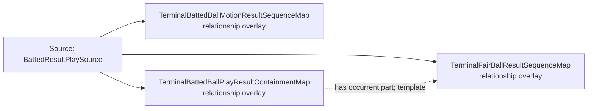

<!-- Generated by scripts/generate_rml_mermaid.py; do not edit. -->
<!-- Mapping SHA-256: 57a5cb1a54e46ee26b27f101cb1468292932df060b1f72c51331c0d029f8c2b5 -->

# Batted-ball result sequence - MLB direct RML

The terminal batted-ball motion and fair-ball classification precede the plate-appearance result, which is contained in the batted-ball play.

Solid relation arrows are explicit parent-triples-map joins. Dotted relation arrows are IRI-template matches inferred by the reviewer from the actual RML templates. Cross-pattern targets are listed in the table rather than drawn, keeping the diagram small.

## Logical sources

| Source | Execution file | JSONPath iterator | Maps in this review |
| --- | --- | --- | ---: |
| `BattedResultPlaySource` | `game-context.json` | `$.liveData.plays.allPlays[?(@._baseballO.terminalPitchIsInPlay == true)]` | 3 |

## Triples maps

| Triples map | Subject class | Emitted relations | Cross-pattern targets |
| --- | --- | --- | --- |
| `TerminalBattedBallMotionResultSequenceMap` | relationship overlay | precedes | precedes -> PlateAppearanceResultMap (template) |
| `TerminalFairBallResultSequenceMap` | relationship overlay | precedes | precedes -> PlateAppearanceResultMap (template) |
| `TerminalBattedBallPlayResultContainmentMap` | relationship overlay | has occurrent part | has occurrent part -> PlateAppearanceResultMap (template) |
