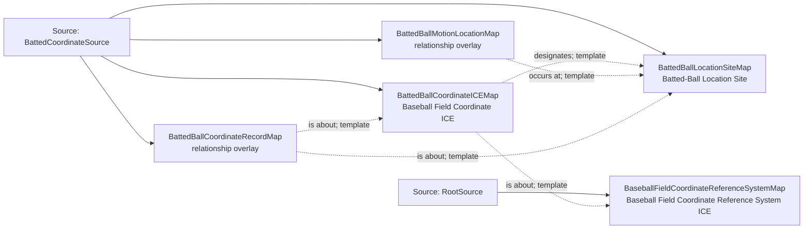

<!-- Generated by scripts/generate_rml_mermaid.py; do not edit. -->
<!-- Mapping SHA-256: 9a3db3cb5b1910df091581beef2527d2be68ec9d03699dce645c1b3a20bbe611 -->

# Batted-ball coordinate location - MLB direct RML

A coordinate information entity designates a batted-ball location site in a baseball-field coordinate reference system, and motion occurs at that site.

Solid relation arrows are explicit parent-triples-map joins. Dotted relation arrows are IRI-template matches inferred by the reviewer from the actual RML templates. Cross-pattern targets are listed in the table rather than drawn, keeping the diagram small.

## Logical sources

| Source | Execution file | JSONPath iterator | Maps in this review |
| --- | --- | --- | ---: |
| `BattedCoordinateSource` | `game-context.json` | `$.liveData.plays.allPlays[*].playEvents[?(@.isPitch == true && @.hitData.coordinates)]` | 4 |
| `RootSource` | `game.json` | `$` | 1 |

## Triples maps

| Triples map | Subject class | Emitted relations | Cross-pattern targets |
| --- | --- | --- | --- |
| `BaseballFieldCoordinateReferenceSystemMap` | Baseball Field Coordinate Reference System ICE | is about | is about -> Baseball Field (template) |
| `BattedBallCoordinateICEMap` | Baseball Field Coordinate ICE | designates, is about | none |
| `BattedBallLocationSiteMap` | Batted-Ball Location Site | type assertion only | none |
| `BattedBallMotionLocationMap` | relationship overlay | occurs at | none |
| `BattedBallCoordinateRecordMap` | relationship overlay | is about | none |
