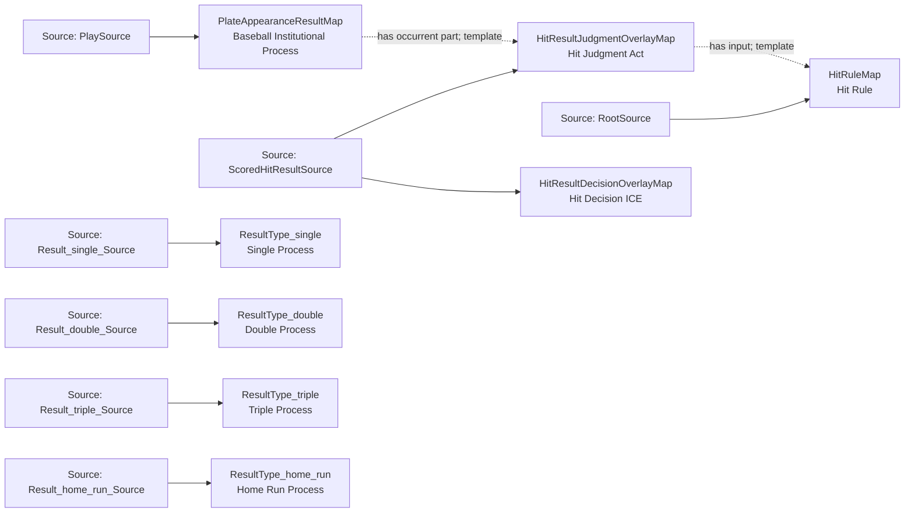

<!-- Generated by scripts/generate_rml_mermaid.py; do not edit. -->
<!-- Mapping SHA-256: afc5ccb32c5b86811c4960eda0c0809e2e3daaa57d51b4d067d7b54dc4b6e50c -->

# Counted hit results - MLB direct RML

Single, double, triple, and home-run result types share a scorer-supported hit judgment and decision while remaining distinct result classes.

Solid relation arrows are explicit parent-triples-map joins. Dotted relation arrows are IRI-template matches inferred by the reviewer from the actual RML templates. Cross-pattern targets are listed in the table rather than drawn, keeping the diagram small.

## Logical sources

| Source | Execution file | JSONPath iterator | Maps in this review |
| --- | --- | --- | ---: |
| `PlaySource` | `game.json` | `$.liveData.plays.allPlays[*]` | 1 |
| `Result_double_Source` | `game.json` | `$.liveData.plays.allPlays[?(@.result.eventType == 'double')]` | 1 |
| `Result_home_run_Source` | `game.json` | `$.liveData.plays.allPlays[?(@.result.eventType == 'home_run')]` | 1 |
| `Result_single_Source` | `game.json` | `$.liveData.plays.allPlays[?(@.result.eventType == 'single')]` | 1 |
| `Result_triple_Source` | `game.json` | `$.liveData.plays.allPlays[?(@.result.eventType == 'triple')]` | 1 |
| `RootSource` | `game.json` | `$` | 1 |
| `ScoredHitResultSource` | `game.json` | `$.liveData.plays.allPlays[?(@.result.eventType == 'single' \|\| @.result.eventType == 'double' \|\| @.result.eventType == 'triple' \|\| @.result.eventType == 'home_run')]` | 2 |

## Triples maps

| Triples map | Subject class | Emitted relations | Cross-pattern targets |
| --- | --- | --- | --- |
| `PlateAppearanceResultMap` | Baseball Institutional Process | has occurrent part, has participant, occurrent part of, occurs at | has participant -> Player (template), occurrent part of -> PlateAppearanceMap (template), occurs at -> Baseball Field (template) |
| `ResultType_single` | Single Process | type assertion only | none |
| `ResultType_double` | Double Process | type assertion only | none |
| `ResultType_triple` | Triple Process | type assertion only | none |
| `ResultType_home_run` | Home Run Process | type assertion only | none |
| `HitResultJudgmentOverlayMap` | Hit Judgment Act | has input, has participant, realizes | has participant -> Person (template), realizes -> Official Scorer (template) |
| `HitResultDecisionOverlayMap` | Hit Decision ICE | type assertion only | none |
| `HitRuleMap` | Hit Rule | type assertion only | none |
