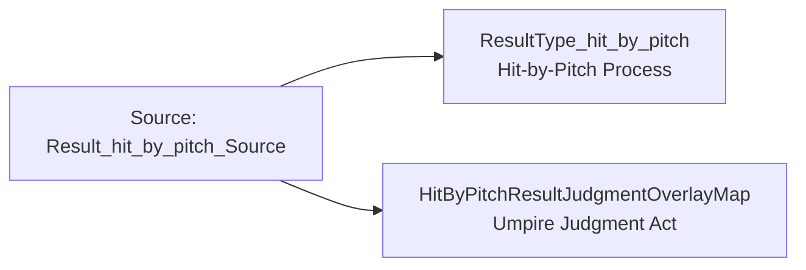

<!-- Generated by scripts/generate_rml_mermaid.py; do not edit. -->
<!-- Mapping SHA-256: afc5ccb32c5b86811c4960eda0c0809e2e3daaa57d51b4d067d7b54dc4b6e50c -->

# Hit-by-pitch result - MLB direct RML

Hit by pitch is a specific plate-appearance result with a source-supported umpire judgment overlay.

Solid relation arrows are explicit parent-triples-map joins. Dotted relation arrows are IRI-template matches inferred by the reviewer from the actual RML templates. Cross-pattern targets are listed in the table rather than drawn, keeping the diagram small.

## Logical sources

| Source | Execution file | JSONPath iterator | Maps in this review |
| --- | --- | --- | ---: |
| `Result_hit_by_pitch_Source` | `game.json` | `$.liveData.plays.allPlays[?(@.result.eventType == 'hit_by_pitch')]` | 2 |

## Triples maps

| Triples map | Subject class | Emitted relations | Cross-pattern targets |
| --- | --- | --- | --- |
| `ResultType_hit_by_pitch` | Hit-by-Pitch Process | type assertion only | none |
| `HitByPitchResultJudgmentOverlayMap` | Umpire Judgment Act | has input, has participant, realizes | has input -> PitchRuleMap (template), has participant -> Person (template), realizes -> Umpire (template) |
