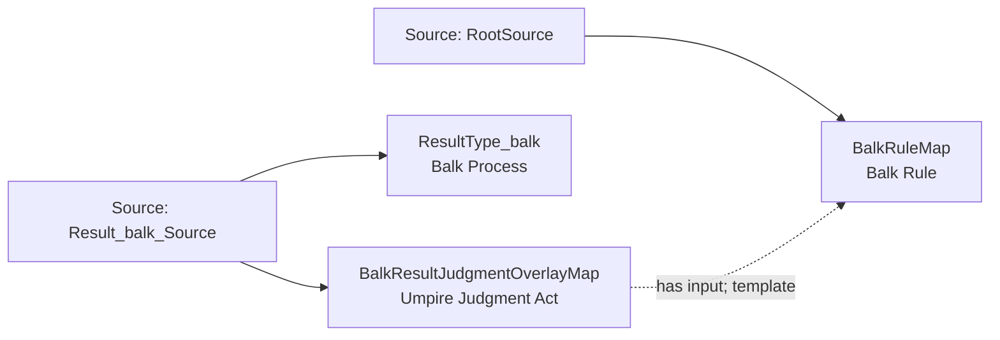

<!-- Generated by scripts/generate_rml_mermaid.py; do not edit. -->
<!-- Mapping SHA-256: a288d8d9e8e638468897751f8eda557afe2f40c2d055fa2acb378682b778531d -->

# Balk result - MLB direct RML

A balk result carries an umpire judgment using the balk rule.

Solid relation arrows are explicit parent-triples-map joins. Dotted relation arrows are IRI-template matches inferred by the reviewer from the actual RML templates. Cross-pattern targets are listed in the table rather than drawn, keeping the diagram small.

## Logical sources

| Source | JSONPath iterator | Maps in this review |
| --- | --- | ---: |
| `Result_balk_Source` | `$.liveData.plays.allPlays[?(@.result.eventType == 'balk')]` | 2 |
| `RootSource` | `$` | 1 |

## Triples maps

| Triples map | Subject class | Emitted relations | Cross-pattern targets |
| --- | --- | --- | --- |
| `ResultType_balk` | Balk Process | type assertion only | none |
| `BalkResultJudgmentOverlayMap` | Umpire Judgment Act | has input | none |
| `BalkRuleMap` | Balk Rule | type assertion only | none |
