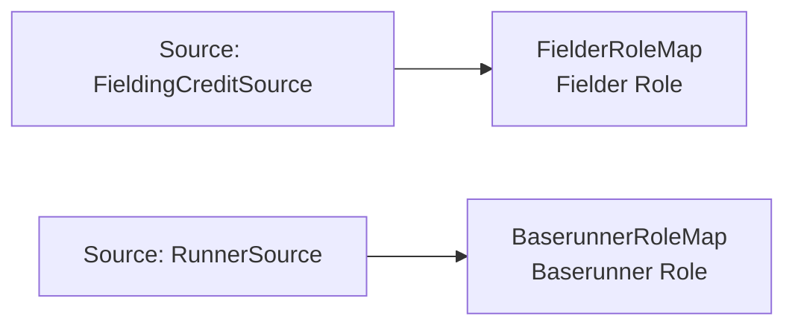

<!-- Generated by scripts/generate_rml_mermaid.py; do not edit. -->
<!-- Mapping SHA-256: 57a5cb1a54e46ee26b27f101cb1468292932df060b1f72c51331c0d029f8c2b5 -->

# Contextual fielding and baserunning roles - MLB direct RML

Players bear game-scoped fielder and baserunner roles rather than being identified with those roles.

Solid relation arrows are explicit parent-triples-map joins. Dotted relation arrows are IRI-template matches inferred by the reviewer from the actual RML templates. Cross-pattern targets are listed in the table rather than drawn, keeping the diagram small.

## Logical sources

| Source | Execution file | JSONPath iterator | Maps in this review |
| --- | --- | --- | ---: |
| `FieldingCreditSource` | `game.json` | `$.liveData.plays.allPlays[*].runners[*].credits[*]` | 1 |
| `RunnerSource` | `game-context.json` | `$.liveData.plays.allPlays[*].runners[*]` | 1 |

## Triples maps

| Triples map | Subject class | Emitted relations | Cross-pattern targets |
| --- | --- | --- | --- |
| `BaserunnerRoleMap` | Baserunner Role | inheres in | inheres in -> Player (template) |
| `FielderRoleMap` | Fielder Role | inheres in | inheres in -> Player (template) |
