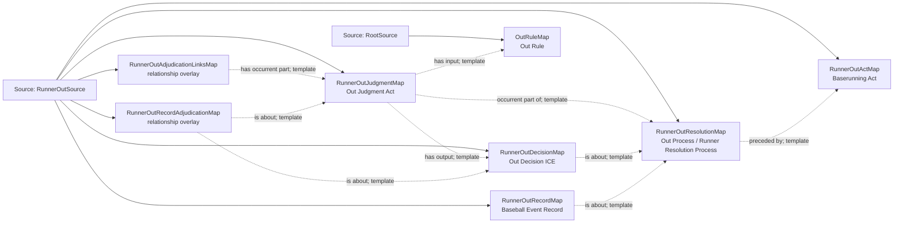

<!-- Generated by scripts/generate_rml_mermaid.py; do not edit. -->
<!-- Mapping SHA-256: ab85db49a66adbcba8c5e82535e3a1824626785795b7c5e3eb7169676c38b3d0 -->

# Runner out - MLB direct RML

A baserunning act precedes an out resolution containing an out judgment and decision described by a separate event record.

Solid relation arrows are explicit parent-triples-map joins. Dotted relation arrows are IRI-template matches inferred by the reviewer from the actual RML templates. Cross-pattern targets are listed in the table rather than drawn, keeping the diagram small.

## Logical sources

| Source | Execution file | JSONPath iterator | Maps in this review |
| --- | --- | --- | ---: |
| `RootSource` | `game.json` | `$` | 1 |
| `RunnerOutSource` | `game-context.json` | `$.liveData.plays.allPlays[*].runners[?(@.movement.isOut == true)]` | 7 |

## Triples maps

| Triples map | Subject class | Emitted relations | Cross-pattern targets |
| --- | --- | --- | --- |
| `RunnerOutActMap` | Baserunning Act | has participant, occurrent part of, occurs at, realizes | has participant -> Player (template), occurrent part of -> Plate Appearance (template), occurs at -> Baseball Field (template), realizes -> BaserunnerRoleMap (template) |
| `RunnerOutResolutionMap` | Out Process, Runner Resolution Process | has participant, occurrent part of, occurs at, preceded by | has participant -> Player (template), occurrent part of -> Plate Appearance (template), occurs at -> Baseball Field (template) |
| `RunnerOutJudgmentMap` | Out Judgment Act | has input, has output, occurrent part of | none |
| `RunnerOutDecisionMap` | Out Decision ICE | is about | none |
| `RunnerOutAdjudicationLinksMap` | relationship overlay | has occurrent part | none |
| `RunnerOutRecordMap` | Baseball Event Record | has text value, identifier, is about | none |
| `RunnerOutRecordAdjudicationMap` | relationship overlay | is about | none |
| `OutRuleMap` | Out Rule | type assertion only | none |
