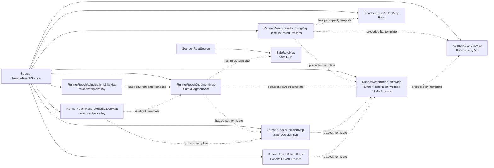

<!-- Generated by scripts/generate_rml_mermaid.py; do not edit. -->
<!-- Mapping SHA-256: ca2bfcd3533f154819be7138ce97981ad9af101d0152bc154d5eac8049dde31a -->

# Runner reaches a base - MLB direct RML

A baserunning act precedes base touching and a safe resolution with judgment, decision, reached-base artifact, and record.

Solid relation arrows are explicit parent-triples-map joins. Dotted relation arrows are IRI-template matches inferred by the reviewer from the actual RML templates. Cross-pattern targets are listed in the table rather than drawn, keeping the diagram small.

## Logical sources

| Source | Execution file | JSONPath iterator | Maps in this review |
| --- | --- | --- | ---: |
| `RootSource` | `game.json` | `$` | 1 |
| `RunnerReachSource` | `game-context.json` | `$.liveData.plays.allPlays[*].runners[?(@.movement.isOut == false && @._baseballO.endsAtScore == false && @._baseballO.hasSupportedStartBase == false)]` | 9 |

## Triples maps

| Triples map | Subject class | Emitted relations | Cross-pattern targets |
| --- | --- | --- | --- |
| `RunnerReachActMap` | Baserunning Act | has participant, occurrent part of, occurs at, realizes | has participant -> Player (template), occurrent part of -> Plate Appearance (template), occurs at -> Baseball Field (template), realizes -> BaserunnerRoleMap (template) |
| `RunnerReachBaseTouchingMap` | Base Touching Process | has participant, preceded by, precedes | has participant -> Player (template) |
| `RunnerReachResolutionMap` | Runner Resolution Process, Safe Process | has participant, occurrent part of, occurs at, preceded by | has participant -> Player (template), occurrent part of -> Plate Appearance (template), occurs at -> Baseball Field (template) |
| `RunnerReachJudgmentMap` | Safe Judgment Act | has input, has output, occurrent part of | none |
| `RunnerReachDecisionMap` | Safe Decision ICE | is about | none |
| `RunnerReachAdjudicationLinksMap` | relationship overlay | has occurrent part | none |
| `ReachedBaseArtifactMap` | Base | type assertion only | none |
| `RunnerReachRecordMap` | Baseball Event Record | has text value, identifier, is about | none |
| `RunnerReachRecordAdjudicationMap` | relationship overlay | is about | none |
| `SafeRuleMap` | Safe Rule | type assertion only | none |
