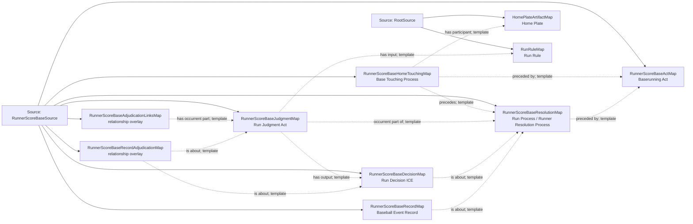

<!-- Generated by scripts/generate_rml_mermaid.py; do not edit. -->
<!-- Mapping SHA-256: a288d8d9e8e638468897751f8eda557afe2f40c2d055fa2acb378682b778531d -->

# Runner scores from a base - MLB direct RML

A baserunning act from a base precedes home-plate touching and a run resolution with judgment, decision, and record.

Solid relation arrows are explicit parent-triples-map joins. Dotted relation arrows are IRI-template matches inferred by the reviewer from the actual RML templates. Cross-pattern targets are listed in the table rather than drawn, keeping the diagram small.

## Logical sources

| Source | JSONPath iterator | Maps in this review |
| --- | --- | ---: |
| `RootSource` | `$` | 2 |
| `RunnerScoreBaseSource` | `$.liveData.plays.allPlays[*].runners[?(@.movement.isOut == false && @.movement.end == 'score' && @.movement.start == '1B' \|\| @.movement.isOut == false && @.movement.end == 'score' && @.movement.start == '2B' \|\| @.movement.isOut == false && @.movement.end == 'score' && @.movement.start == '3B')]` | 8 |

## Triples maps

| Triples map | Subject class | Emitted relations | Cross-pattern targets |
| --- | --- | --- | --- |
| `RunnerScoreBaseActMap` | Baserunning Act | has participant, occurrent part of, occurs at, realizes | has participant -> Player (template), occurrent part of -> GameMap (template), occurs at -> Baseball Field (template), realizes -> BaserunnerRoleMap (template) |
| `RunnerScoreBaseHomeTouchingMap` | Base Touching Process | has participant, preceded by, precedes | has participant -> Player (template) |
| `RunnerScoreBaseResolutionMap` | Run Process, Runner Resolution Process | has participant, occurrent part of, occurs at, preceded by | has participant -> Player (template), occurrent part of -> GameMap (template), occurs at -> Baseball Field (template) |
| `RunnerScoreBaseJudgmentMap` | Run Judgment Act | has input, has output, occurrent part of | none |
| `RunnerScoreBaseDecisionMap` | Run Decision ICE | is about | none |
| `RunnerScoreBaseAdjudicationLinksMap` | relationship overlay | has occurrent part | none |
| `RunnerScoreBaseRecordMap` | Baseball Event Record | has text value, identifier, is about | none |
| `RunnerScoreBaseRecordAdjudicationMap` | relationship overlay | is about | none |
| `HomePlateArtifactMap` | Home Plate | type assertion only | none |
| `RunRuleMap` | Run Rule | type assertion only | none |
